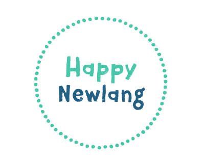

# HappyNewlang

            
              
 

. Who am I?

    - My name is Yanina

    - I live in the City of Buenos Aires, Argentina

    - I am a Psychopedagogue and a Javascript student.
    
2. Challenge

Create a website to present as a final project of the Web Development course using Javascritp, Jquery as well as the use of an API

3. Product summary

Developed in Visual Studio Code, it is an English academy for children and young people in Buenos Aires where they will learn the language in a dynamic and playful way. They also have the possibility of taking international exams and taking courses abroad.
You can choose a course and simulate a payment. It also has an online store with products from the academy. The contact form is validated by displaying the user's data on the console. An api is included that simulates data from the course teachers and animations are used to make the site more dynamic.

Author:

Yanina Calviello
